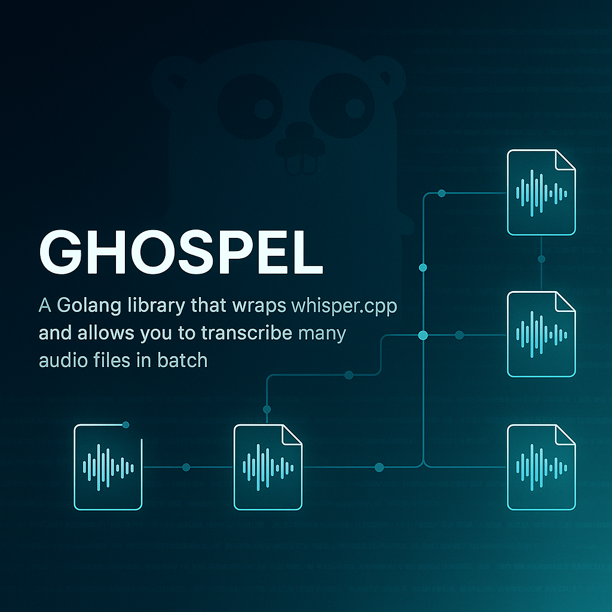

# Ghospel

A blazing-fast, privacy-first command-line audio transcription tool for macOS, powered by local AI
models and optimized for Apple Silicon.

[](https://www.apple.com/macos/)
[](https://github.com/pascalwhoop/ghospel/actions/workflows/release.yml)
[](https://golang.org/)
[](https://opensource.org/licenses/MIT)



## Features

### 🎯 **Core Functionality**

- **Single File & Batch Processing**: Transcribe individual audio files or entire directories
  recursively
- **Multiple Audio Formats**: Support for MP3, M4A, WAV, FLAC, MP4, and more via intelligent format
  detection
- **Smart Output**: Generates `.txt` files alongside original audio files with identical names
- **Folder Structure Preservation**: Maintains directory hierarchy when processing folders

### 🚀 **Performance & Optimization**

- **Apple Silicon Optimized**: Native support for M1/M2/M3 chips using MLX and GGML backends
- **Concurrent Processing**: Parallel transcription of multiple files with configurable worker pools
- **Intelligent Caching**: Downloads and caches models locally to avoid repeated network requests
- **Memory Efficient**: Streams large audio files without loading entire content into memory

### 📥 **Download & Caching System**

- **Automatic Model Downloads**: Fetches required Whisper models on first use
- **Configurable Cache Location**: Default `~/.whisper/` with option to customize via config or
  flags
- **Smart Cache Management**: Automatic cleanup of old/unused files with configurable retention
  policies
- **Resume Interrupted Downloads**: Robust download system with retry logic and partial download
  support

### 🔧 **Audio Processing**

- **Format Conversion**: Automatic conversion to 16kHz mono WAV via FFmpeg integration
- **Audio Validation**: Pre-processing validation to ensure audio quality and format compatibility
- **Batch Optimization**: Efficient processing pipeline for large audio collections
- **Temporary File Management**: Clean handling of intermediate conversion files

### 📊 **Progress & Monitoring**

- **Real-time Progress Bars**: Visual progress indication for downloads, conversions, and
  transcriptions
- **Detailed Logging**: Comprehensive logging with configurable verbosity levels
- **Processing Statistics**: Time estimates, throughput metrics, and completion summaries
- **Error Recovery**: Graceful handling of failures with detailed error reporting

### ⚙️ **Configuration & Customization**

- **Model Selection**: Support for different Whisper model sizes (tiny, base, small, medium, large)
- **Custom Prompts**: Configurable transcription prompts for improved accuracy in specific domains
- **Output Formatting**: Options for timestamp inclusion, speaker identification, and text
  formatting
- **Concurrent Limits**: Adjustable parallel processing limits based on system resources

## Installation

### Prerequisites

- macOS 12.0+ (Monterey or later)
- FFmpeg (installed automatically via Homebrew if not present)

### Install via Homebrew

```bash
brew tap pascalwhoop/ghospel
brew install ghospel
```

### Install from Source

```bash
git clone https://github.com/pascalwhoop/ghospel.git
cd ghospel
go build -o ghospel ./cmd/ghospel
sudo mv ghospel /usr/local/bin/
```

### Download Binary

Download the latest release from [Releases](https://github.com/pascalwhoop/ghospel/releases) and add
to your PATH.

## Quick Start

### Transcribe a Single File

```bash
ghospel transcribe audio.mp3
# Creates: audio.txt
```

### Transcribe a Folder

```bash
ghospel transcribe /path/to/podcast-episodes/
# Creates .txt files for each audio file found
```

### Transcribe with Custom Output Directory

```bash
ghospel transcribe audio.mp3 --output-dir ./transcripts/
```

### Transcribe Remote File

```bash
ghospel transcribe https://example.com/podcast.mp3
# Downloads, caches, and transcribes
```

## Usage Examples

### Basic Transcription

```bash
# Single file
ghospel transcribe interview.m4a

# Multiple files
ghospel transcribe *.mp3

# Recursive directory processing
ghospel transcribe ./audio-files/ --recursive
```

### Advanced Options

```bash
# Use specific model
ghospel transcribe audio.mp3 --model large-v3

# Custom cache directory
ghospel transcribe audio.mp3 --cache-dir /custom/path/

# Include timestamps
ghospel transcribe audio.mp3 --timestamps

# Limit concurrent jobs
ghospel transcribe ./folder/ --workers 2

# Custom prompt for better accuracy
ghospel transcribe meeting.mp3 --prompt "This is a business meeting about quarterly planning"
```

### Configuration Management

```bash
# View current configuration
ghospel config show

# Set default model
ghospel config set model large-v3-turbo

# Set default cache directory
ghospel config set cache_dir ~/.whisper-cache

# Reset to defaults
ghospel config reset
```

### Model Management

```bash
# List available models
ghospel models list

# Download specific model
ghospel models download large-v3

# Remove unused models
ghospel models cleanup
```

## Configuration

### Configuration File

Ghospel uses a YAML configuration file located at `~/.config/ghospel/config.yaml`:

```yaml
# Model settings
model: "large-v3-turbo" # Default model size
language: "auto" # Language detection (auto/en/es/fr/etc.)
prompt: "" # Default transcription prompt

# Processing settings
workers: 4 # Concurrent transcription jobs
chunk_size: "30s" # Audio chunk size for long files

# Cache settings
cache_dir: "~/.whisper"
cache_retention: "30d" # Keep cached files for 30 days
auto_cleanup: true

# Output settings
output_format: "txt" # Output format (txt/srt/vtt)
include_timestamps: false
preserve_structure: true # Maintain folder hierarchy

# Audio processing
ffmpeg_path: "/opt/homebrew/bin/ffmpeg"
temp_dir: "/tmp/ghospel"
```

### Environment Variables

```bash
export GHOSPEL_CACHE_DIR="/custom/cache/path"
export GHOSPEL_MODEL="large-v3"
export GHOSPEL_WORKERS="8"
export GHOSPEL_LOG_LEVEL="debug"
```

## Command Reference

### `ghospel transcribe [files/folders...]`

Transcribe audio files or directories.

**Options:**

- `--model, -m`: Whisper model to use (tiny/base/small/medium/large-v3/large-v3-turbo)
- `--output-dir, -o`: Custom output directory
- `--workers, -w`: Number of concurrent workers (default: 4)
- `--recursive, -r`: Process directories recursively
- `--timestamps, -t`: Include timestamps in output
- `--prompt, -p`: Custom transcription prompt
- `--language, -l`: Force specific language (default: auto-detect)
- `--format, -f`: Output format (txt/srt/vtt)
- `--cache-dir`: Override default cache directory
- `--verbose, -v`: Verbose output
- `--quiet, -q`: Suppress progress bars

### `ghospel models`

Manage Whisper models.

**Subcommands:**

- `list`: Show available and downloaded models
- `download [model]`: Download specific model
- `cleanup`: Remove unused cached models
- `info [model]`: Show model information

### `ghospel config`

Manage configuration settings.

**Subcommands:**

- `show`: Display current configuration
- `set [key] [value]`: Set configuration value
- `get [key]`: Get configuration value
- `reset`: Reset to default configuration

### `ghospel cache`

Manage download and processing cache.

**Subcommands:**

- `info`: Show cache statistics
- `clean`: Remove old cached files
- `clear`: Clear entire cache
- `path`: Show cache directory path

## Performance Optimization

### Model Selection Guide

- **tiny**: Fastest, least accurate (~39 MB)
- **base**: Good balance of speed and accuracy (~142 MB)
- **small**: Better accuracy, moderate speed (~488 MB)
- **medium**: High accuracy, slower (~1.5 GB)
- **large-v3**: Best accuracy, slowest (~2.9 GB)
- **large-v3-turbo**: Best balance of speed and accuracy (~1.5 GB) **[DEFAULT]**

### Hardware Recommendations

- **M1/M2/M3 Mac**: Use MLX backend (automatic)
- **Intel Mac**: Use GGML backend (automatic)
- **Memory**: 8GB+ recommended for large models
- **Storage**: 5GB+ free space for model cache

### Batch Processing Tips

```bash
# Process large collections efficiently
ghospel transcribe ./podcasts/ --workers 8 --model base

# For very large files, use chunking
ghospel transcribe long-meeting.mp3 --chunk-size 10m

# Optimize for specific content type
ghospel transcribe lectures/ --prompt "Academic lecture content"
```

## Output Formats

### Plain Text (.txt)

```
The quick brown fox jumps over the lazy dog. This is a sample transcription
with proper punctuation and formatting.
```

### SubRip (.srt)

```
1
00:00:00,000 --> 00:00:03,000
The quick brown fox jumps over the lazy dog.

2
00:00:03,000 --> 00:00:06,000
This is a sample transcription with timestamps.
```

### WebVTT (.vtt)

```
WEBVTT

00:00:00.000 --> 00:00:03.000
The quick brown fox jumps over the lazy dog.

00:00:03.000 --> 00:00:06.000
This is a sample transcription with timestamps.
```

## Troubleshooting

### Common Issues

**FFmpeg not found:**

```bash
# Install FFmpeg
brew install ffmpeg
```

**Model download fails:**

```bash
# Clear cache and retry
ghospel cache clear
ghospel models download base
```

**Out of memory errors:**

```bash
# Use smaller model or reduce workers
ghospel transcribe file.mp3 --model tiny --workers 1
```

**Permission denied:**

```bash
# Check cache directory permissions
ls -la ~/.whisper/
chmod 755 ~/.whisper/
```

### Debug Mode

```bash
# Enable verbose logging
ghospel transcribe file.mp3 --verbose

# Enable debug mode
export GHOSPEL_LOG_LEVEL=debug
ghospel transcribe file.mp3
```

## Development

### Project Structure

```
ghospel/
├── cmd/ghospel/           # Main CLI entry point
├── internal/
│   ├── cli/              # CLI application setup
│   ├── commands/         # CLI command implementations
│   ├── config/           # Configuration management
│   ├── transcription/    # Core transcription service
│   ├── models/           # Model management
│   └── cache/            # Cache management
├── go.mod
├── go.sum
└── README.md
```

### Building from Source

```bash
git clone https://github.com/pascalwhoop/ghospel.git
cd ghospel
go mod tidy
go build -o ghospel ./cmd/ghospel
```

### Testing the CLI

```bash
# Test basic functionality
./ghospel --help
./ghospel transcribe --help
./ghospel models list
./ghospel config show
```

## Contributing

1. Fork the repository
2. Create your feature branch (`git checkout -b feature/amazing-feature`)
3. Commit your changes (`git commit -m 'Add amazing feature'`)
4. Push to the branch (`git push origin feature/amazing-feature`)
5. Open a Pull Request

## License

This project is licensed under the MIT License - see the [LICENSE](LICENSE) file for details.

## Acknowledgments

- [whisper.cpp](https://github.com/ggerganov/whisper.cpp) - High-performance Whisper inference
- [FFmpeg](https://ffmpeg.org/) - Audio/video processing
- [OpenAI Whisper](https://github.com/openai/whisper) - Original Whisper models
- [VoiceInk](https://github.com/Beingpax/VoiceInk) - Desktop inspiration and shared architecture

---

**Made for macOS developers who value privacy, performance, and simplicity.**
